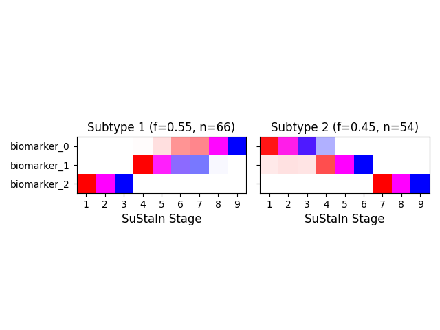
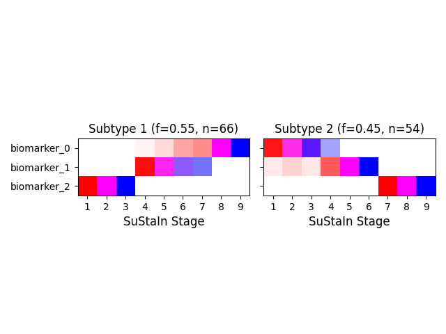

# mv-sustain

A longitudinal, multi-visit extension of the **SuStaIn** (Subtype and Stage Inference) algorithm, built on top of [pySuStaIn](https://github.com/ucl-pond/pySuStaIn), the reference Python implementation by Leon Aksman, Peter Wijeratne, and collaborators at the UCL POND group.

SuStaIn jointly infers, from cross-sectional data, (a) a small number of distinct progression sequences ("subtypes") and (b) each individual's position along their subtype's sequence ("stage") — separating *which pattern* someone follows from *how far along* they are, without needing longitudinal follow-up.

Classic SuStaIn scores each observation (each visit) independently. When a cohort instead has multiple visits per patient, that independence assumption discards information: knowing that several visits belong to the same person constrains which subtype and stage they can plausibly occupy. **MV-SuStaIn** ("Multi-Visit SuStaIn") addresses this by aggregating a patient's visits into a single joint likelihood *before* inferring subtype and stage, so repeated observations reinforce one another instead of being treated as unrelated data points.

This repository provides:

- **`Stacked*Sustain`** classes — classic, independent-visit SuStaIn, provided as the fair baseline for comparison.
- **`Longitudinal*Sustain`** classes — the joint patient-level likelihood extension (MV-SuStaIn), for both z-score and ordinal likelihoods.
- **`SustainRunner`** — a single entry point that routes to the correct model class given a likelihood type and a `use_longitudinal_likelihood` flag, so most users won't need to touch the model classes directly.

## Status

This is research software under active development. The code here is a periodically-updated extract of a larger, private research codebase where the full validation study, simulation harness, and clinical application work live. This repository is kept intentionally minimal: it's the reusable algorithm layer, not the research pipeline built on top of it.

## Requirements

- Python 3.9+ (developed and tested on 3.11)
- `git` on your PATH — pip installs pySuStaIn directly from its GitHub repository, since it isn't published on PyPI
- ~1.5GB free disk space for dependencies (see the CPU-only note below; a default install can balloon to ~5GB by pulling GPU support you likely don't need)

## Installation

```bash
git clone https://github.com/cmattjie/mv-sustain.git
cd mv-sustain
pip install -e .
```

**If you don't need GPU acceleration** (most usage — the fitting itself is CPU-bound; `torch` is only used for a few tensor ops in the z-score likelihood), install a CPU-only PyTorch *first*, then install this package. This avoids pulling PyTorch's default CUDA build and several GB of NVIDIA dependencies that most machines won't use:

```bash
pip install torch --index-url https://download.pytorch.org/whl/cpu
pip install -e .
```

Both install paths were verified from a clean virtual environment (no pre-existing dependencies) before release — the CPU-only path finishes in about a minute and installs ~1.4GB instead of ~5GB.

This pulls in [pySuStaIn](https://github.com/ucl-pond/pySuStaIn) directly from its GitHub repository (it is not published on PyPI).

## Quickstart

```bash
python examples/quickstart.py
```

This simulates a small multi-visit synthetic cohort with two known progression subtypes and fits both the classic and longitudinal models on it, to demonstrate the API end-to-end. It is intentionally small and fast — see the script's docstring for details, and treat its output as a sanity check rather than a performance benchmark.

It also produces a positional variance diagram (PVD) for each model — pySuStaIn's standard visualization of the inferred subtype sequences, showing for each subtype which biomarker tends to cross into abnormality at which stage:

| Classic (stacked) SuStaIn | MV-SuStaIn (longitudinal) |
|---|---|
|  |  |

On this small, well-separated toy dataset the two methods recover the same group-level sequences — the difference between them here is in per-patient subtype-assignment accuracy (a quantitative effect of aggregating each patient's visits before assigning), not in the shape of the recovered sequences themselves. Divergence in the recovered sequences is more likely to appear with noisier or more ambiguous data; this demo is not tuned to show that.

Minimal usage sketch:

```python
from mv_sustain import SustainRunner

runner = SustainRunner(
    likelihood="zscore",
    n_subtypes=2,
    biomarker_labels=["biomarker_0", "biomarker_1", "biomarker_2"],
    dataset_name="my_cohort",
    output_folder="/path/to/output",
    N_startpoints=10,
    N_iterations_MCMC=10000,
    use_parallel_startpoints=False,
    use_longitudinal_likelihood=True,   # False for classic SuStaIn
    longitudinal_patient_ids=patient_ids,
    seed=0,
)
runner.fit(X_train, Z_vals=Z_vals, Z_max=Z_max, sigma_noise=1.0, patient_ids=patient_ids)
print(runner.fit_result_.ml_subtype, runner.fit_result_.ml_stage)
```

## Validation

[`validation/REPORT.md`](validation/REPORT.md) — a preliminary simulation study comparing MV-SuStaIn against classic SuStaIn on synthetic data across two likelihoods and several visit counts. **Explicitly preliminary**: no result in the main study reaches statistical significance at its current sample size (12 paired repeats), and it says so; a follow-up under harder noise and more subtypes does reach significance, with the attribution caveats stated in that section. A larger-repeat follow-up and real-cohort validation are in progress.

## Acknowledgments

MV-SuStaIn is built entirely on top of [pySuStaIn](https://github.com/ucl-pond/pySuStaIn), created by Leon Aksman and Peter Wijeratne, with contributions from Arman Eshaghi, Alexandra Young, Cameron Shand, and the rest of the UCL POND group. This repository would not exist without their implementation and the underlying SuStaIn algorithm it packages; please see "Citing this work" below for the papers to reference.

## Citing this work

If you use this package, please cite the original SuStaIn and pySuStaIn papers (per pySuStaIn's own citation request):

1. Young AL, Marinescu RV, Oxtoby NP, et al. Uncovering the heterogeneity and temporal complexity of neurodegenerative diseases with Subtype and Stage Inference. *Nat Commun*. 2018;9(1):4273. https://doi.org/10.1038/s41467-018-05892-0
2. Aksman LM, Wijeratne PA, Oxtoby NP, et al. pySuStaIn: A Python implementation of the Subtype and Stage Inference algorithm. *SoftwareX*. 2021;16:100811. https://doi.org/10.1016/j.softx.2021.100811

Please also cite the paper for whichever progression-pattern model you use:

3. Z-score likelihood: same as reference 1 above.
4. Ordinal likelihood: Young AL, Vogel JW, Robinson JL, et al. Ordinal SuStaIn: Subtype and Stage Inference for Clinical Rating Scale and Ordinal Data. *Front Artif Intell*. 2021;4:613261. https://doi.org/10.3389/frai.2021.613261
5. Mixture (event-based) likelihood: https://doi.org/10.1016/j.neuroimage.2012.01.062, plus https://doi.org/10.1093/brain/awu176 if using Gaussian mixture modeling or https://doi.org/10.1002/alz.12083 if using kernel density estimation.

A citable reference for the longitudinal (MV-SuStaIn) extension's full, peer-reviewed validation will be added here once available (manuscript/thesis in preparation). In the meantime, see [`validation/REPORT.md`](validation/REPORT.md) for a preliminary simulation study, and `CITATION.cff` for a machine-readable citation of this software as it currently stands.

## License

MIT — see `LICENSE`. This project adapts and extends pySuStaIn (also MIT); see `THIRD_PARTY_NOTICES.md` for pySuStaIn's original license text and copyright notice.
