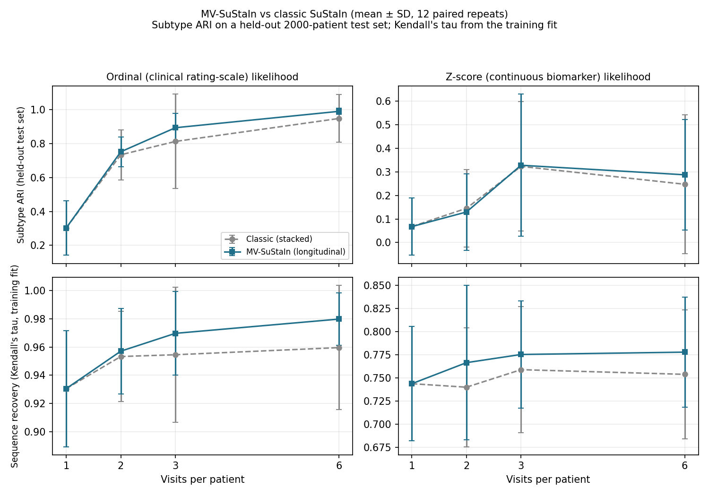
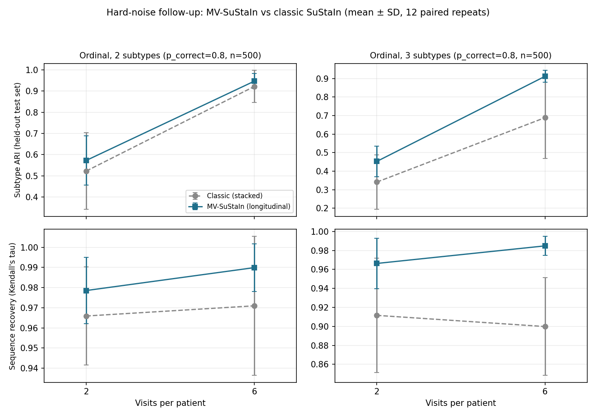

# MV-SuStaIn: A Preliminary Simulation Validation

**Status: preliminary / observational. Full-power validation is ongoing.**

This report describes a small simulation study comparing MV-SuStaIn ("Multi-Visit SuStaIn" — a longitudinal, joint patient-level likelihood extension of SuStaIn) against classic SuStaIn (independent-visit training) on synthetic data. It is released as a snapshot of ongoing work, not as a completed validation — see [Limitations](#5-limitations) before drawing conclusions from it.

**Update:** [Section 4](#4-follow-up-harder-noise-larger-cohort-more-subtypes) adds a follow-up under harder noise, a larger cohort, and more subtypes, where MV-SuStaIn's advantage becomes large and statistically significant — unlike the main study in Section 3, which does not reach significance. Read both sections; they are separate studies with separate conclusions.

---

## 1. Background

SuStaIn (Subtype and Stage Inference) jointly infers, from cross-sectional data, a small number of distinct disease progression sequences ("subtypes") and each individual's position along their subtype's sequence ("stage") [1]. Classic SuStaIn scores every observation independently, which discards information when a cohort instead has multiple visits per patient: knowing that several visits belong to the same person constrains which subtype and stage they can plausibly occupy.

MV-SuStaIn addresses this by aggregating a patient's visits into a single joint likelihood *before* inferring subtype and stage, so repeated observations reinforce one another instead of being treated as unrelated data points. The implementation, built on top of pySuStaIn (Aksman, Wijeratne, et al.) [2], is available at [github.com/cmattjie/mv-sustain](../README.md) (code, MIT license).

**Theoretical basis and testable prediction.** If a patient's visits are conditionally independent given their subtype and each visit's own stage, the correct likelihood for identifying that subtype is the product of the per-visit likelihoods, not any single visit's likelihood alone or an approximation of that product assembled after independent training. Pooling several noisy observations reduces uncertainty roughly the way averaging repeated noisy measurements does, which predicts the benefit should be largest when a single visit's signal is weak or ambiguous, and smallest when one visit already identifies the subtype confidently. That prediction is what this report tests, not something it assumes: Section 3 finds a weak, inconsistent effect under easy, well-separated simulation conditions, and Section 4 finds a large, statistically significant one once the disambiguation problem is harder — consistent with the prediction, though see that section's own caveat on attribution.

## 2. Simulation Design

Two-subtype synthetic cohorts (**60 training patients**, **4 biomarkers**, **12 total events** — each biomarker crossing 3 ordinal score levels or 3 z-score thresholds [1, 2, 3 SD], z-max 5) were generated under two likelihoods used by SuStaIn: **ordinal** (discrete clinical rating-scale data, e.g. resembling MDS-UPDRS/MoCA-style items; correctness probability 0.9) and **z-score** (continuous biomarker data; noise σ=1.0, uniform noise logic). This is a single, comparatively favorable noise/difficulty setting — see [Limitations](#5-limitations).

For each likelihood, cohorts were simulated at four visit counts per patient (1, 2, 3, 6) and fit two ways — classic (stacked, independent-visit) and MV-SuStaIn (longitudinal, joint-likelihood) — on the *same* simulated training data, so the only thing that differs between the two fits is the training likelihood mechanism, not the data.

Each of the 16 (likelihood × visit-count × mode) conditions was repeated across **12 seeds**, with the classic and MV-SuStaIn fit of a given condition sharing a seed so the comparison is paired (same simulated cohort, two training mechanisms). Fitting used `N_startpoints=5`, `N_mcmc=8000` per fit. Exact parameters and the driver script are reproducible from the source repository's `scripts/jul2026/` (not included in this public release, since it depends on the private research harness — the method implementation itself, in this repository, is what matters for reproducing the mechanism).

**Evaluation uses a held-out test set, not the training cohort.** Every fit is additionally scored against an independent, freshly-simulated **2000-patient test cohort** (fixed seed, same generative process, disjoint from the 60 training patients) at the matching visit-count group. Subtype recovery (ARI, permutation accuracy) and stage accuracy are read from this held-out evaluation; fitting a model and re-scoring it on its own training data would not be a generalization claim. Sequence recovery (Kendall's tau) has no test-set equivalent — it scores the sequence recovered from the training fit against the known ground-truth generative sequence, not a per-patient prediction — so it is read from the training fit itself.

Per the project's own methodology (classic SuStaIn's post-hoc visit-combination is a valid, necessary step for it, but is not the correct comparison point for MV-SuStaIn, whose default output already reflects the full joint-visit posterior — using it there would inflate confidence), classic SuStaIn is scored on its post-hoc test metric and MV-SuStaIn on its unconstrained test metric, except at 1 visit, where the two are mathematically identical and no post-hoc combination applies to either model.

## 3. Results

*Mean ± SD across 12 paired repeats. Dashed grey: classic SuStaIn. Solid blue: MV-SuStaIn. ARI is on the held-out 2000-patient test set; Kendall's tau is a training-fit property (see above).*

| Likelihood | Visits | ARI (MV) | ARI (classic) | p | Kendall-τ (MV) | Kendall-τ (classic) | p |
|---|---|---|---|---|---|---|---|
| Ordinal | 1 | 0.302 | 0.302 | — | 0.931 | 0.931 | — |
| Ordinal | 2 | 0.751 | 0.733 | 0.91 | 0.957 | 0.953 | 0.45 |
| Ordinal | 3 | 0.893 | 0.812 | 0.34 | 0.970 | 0.955 | 0.38 |
| Ordinal | 6 | 0.989 | 0.947 | 0.09 | 0.980 | 0.960 | 0.13 |
| Z-score | 1 | 0.068 | 0.068 | — | 0.744 | 0.744 | — |
| Z-score | 2 | 0.130 | 0.145 | 0.27 | 0.766 | 0.740 | 0.31 |
| Z-score | 3 | 0.328 | 0.324 | 0.97 | 0.775 | 0.759 | 0.41 |
| Z-score | 6 | 0.288 | 0.248 | 0.42 | 0.778 | 0.754 | 0.14 |

(p = two-sided Wilcoxon signed-rank, paired across the 12 shared-seed repeats; full table with all four metrics in `aggregate_summary.csv`.)

**Sanity check:** at 1 visit, MV-SuStaIn and classic SuStaIn produce identical results on every metric, exactly as expected — with a single visit there is nothing for the joint-likelihood mechanism to aggregate across, so the two training procedures are mathematically the same. This is a basic correctness check on the implementation, not a scientific finding.

**Ordinal likelihood:** MV-SuStaIn's mean is at or above classic SuStaIn on both ARI and Kendall's tau at every visit count ≥2, and the Kendall's tau gap widens with more visits (2 → 6 visits: p drops from 0.45 to 0.13). This is directionally consistent with the hypothesis that joint-visit training helps more as more visits become available, and it is the cleanest single trend in this dataset.

**Z-score likelihood:** the pattern is less consistent — classic SuStaIn's test-set ARI is slightly *ahead* at 2 visits, the two are essentially tied at 3, and MV-SuStaIn is ahead at 6; direction is not monotonic across visit counts. This does not replicate an earlier, informal finding (from before a June 2026 fix to the simulation's noise handling) that MV-SuStaIn was *worse* on z-score staging — the current, corrected picture is a wash rather than a disadvantage, which is itself worth noting but is not a strong claim either way.

## 4. Follow-up: harder noise, larger cohort, more subtypes

The study above used one comparatively favorable setting (ordinal correctness probability 0.9, 60 training patients, 2 subtypes). This follow-up changes three things at once — noise (correctness probability **0.8**), cohort size (**500** training patients), and subtype count (**2 or 3**) — to test whether the MV-SuStaIn advantage holds up, and whether it depends on any of these. Ordinal likelihood only; visit counts 2 and 6; same paired-seed design and held-out 2000-patient test evaluation as above; 12 repeats per condition.

| Subtypes | Visits | ARI (MV) | ARI (classic) | p | Kendall-τ (MV) | Kendall-τ (classic) | p |
|---|---|---|---|---|---|---|---|
| 2 | 2 | 0.573 | 0.523 | 0.064 | 0.979 | 0.966 | 0.094 |
| 2 | 6 | 0.947 | 0.922 | 0.38 | 0.990 | 0.971 | **0.016** |
| 3 | 2 | 0.453 | 0.341 | **0.009** | 0.966 | 0.912 | **0.005** |
| 3 | 6 | 0.912 | 0.689 | **0.0005** | 0.985 | 0.900 | **0.0005** |

**This is a materially different result from the rest of the report: at 3 subtypes, MV-SuStaIn reaches conventional statistical significance on most metrics.** At 6 visits, all four metrics in `aggregate_summary.csv` (accuracy, ARI, Kendall's tau, stage accuracy) are significant at p=0.0005 — the minimum possible value at n=12, because MV-SuStaIn won all 12 of 12 paired repeats on both ARI and Kendall's tau, zero losses, zero ties. At 2 visits, three of the four metrics are significant (accuracy, ARI, Kendall's tau: p≤0.0093) but **stage accuracy is not** (p=0.064) — a real exception, not one to round away. At 2 subtypes under this same harder/larger setting, the picture is closer to the original report — mostly not significant, except Kendall's tau at 6 visits (p=0.016).

**Interpretation, with an honest caveat**: because noise, cohort size, and subtype count all changed together relative to the main study, this cannot isolate which factor drives the much larger effect at 3 subtypes. The closest thing to a controlled contrast in this data is 2-vs-3 subtypes at matched noise and cohort size, which points at **subtype count** as the likely main driver — mechanistically plausible, since disentangling more candidate progression patterns from noisy per-visit data is exactly the harder disambiguation problem where pooling a patient's visits into one joint decision should matter most. But this is an inference from observational data, not a controlled ablation, and is offered as a hypothesis this follow-up strengthens rather than a settled conclusion.

**Verification**: `metrics_test_by_visits[...]['posthoc']` was spot-checked against `['unconstrained']` for a classic-mode run to confirm the two differ substantially in the expected direction (posthoc much higher, since a single-visit posterior is naturally noisy) — i.e., the posthoc/unconstrained methodology is doing real work here, not coincidentally returning similar numbers regardless of which is used.

## 5. Limitations

- **The main study (Section 3) reaches no statistically significant result** (all Wilcoxon p ≥ 0.0625). **The follow-up (Section 4) does**, but only at 3 subtypes — at 2 subtypes under the same harder/larger setting, results are still mostly non-significant. Read Sections 3 and 4 as separate studies with separate conclusions, not one pooled result.
- Both studies are simulated data only. The follow-up changed noise, cohort size, and subtype count simultaneously (see Section 4's caveat on attribution); a proper ablation isolating each factor is still open.
- The main study's cohort size (60 training patients, 4 biomarkers) is modest by real-world standards; the follow-up used 500 patients but the same 4 biomarkers.
- Real-cohort behavior (the subject of ongoing work) may differ from any simulation study, however parameterized.
- Remaining open work: an ablation isolating subtype count from noise and cohort size; a z-score version of the hard-noise follow-up (this one was ordinal-only); and real-cohort validation.

## Data & Code Availability

Code: this repository (MIT license). Simulated data only; no real patient data was used in this study. Full metric tables: `validation/aggregate_summary.csv` (main study, Section 3), `validation/hard_ordinal_k2_summary.csv` and `validation/hard_ordinal_k3_summary.csv` (follow-up, Section 4).

## References

1. Young AL, Marinescu RV, Oxtoby NP, et al. Uncovering the heterogeneity and temporal complexity of neurodegenerative diseases with Subtype and Stage Inference. *Nat Commun*. 2018;9(1):4273. https://doi.org/10.1038/s41467-018-05892-0
2. Aksman LM, Wijeratne PA, Oxtoby NP, et al. pySuStaIn: A Python implementation of the Subtype and Stage Inference algorithm. *SoftwareX*. 2021;16:100811. https://doi.org/10.1016/j.softx.2021.100811
